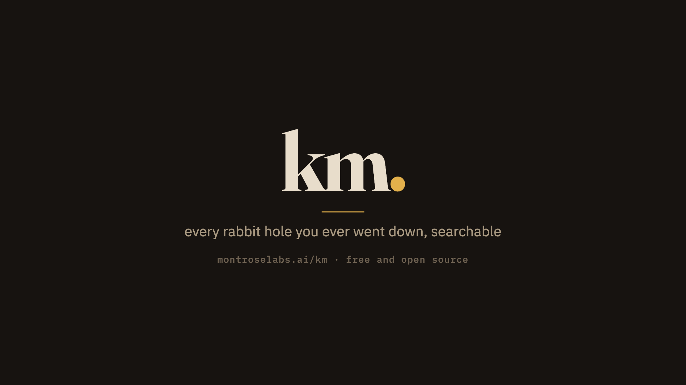
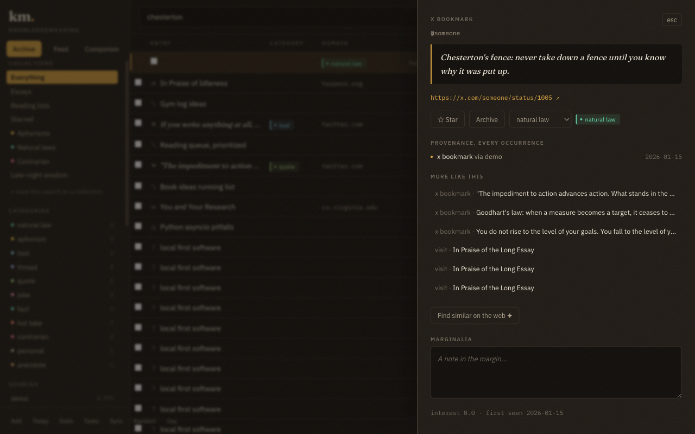
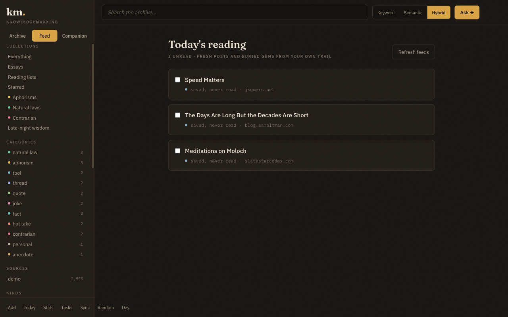
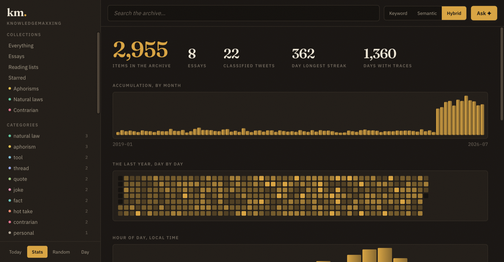
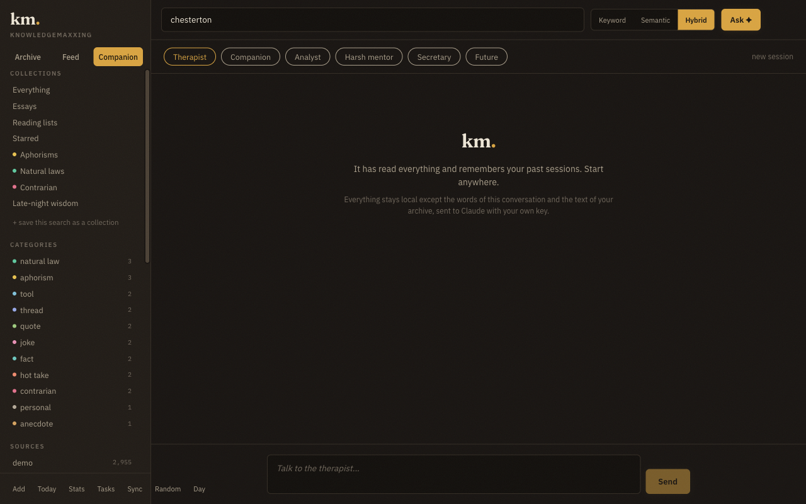

<p align="center">
  
</p>

<p align="center">
  <a href="https://montroselabs.ai/km/">Website + demo video</a> ·
  <a href="#setup">Quickstart</a> ·
  <a href="#privacy">Privacy</a>
</p>

# km (knowledgemaxxing)

**Every rabbit hole you ever went down, searchable.**

<table>
  <tr>
    <td></td>
    <td></td>
  </tr>
  <tr>
    <td></td>
    <td></td>
  </tr>
</table>

<sub>All screenshots show the bundled synthetic demo data. The chat shot
predates the current archivist agent and multi-tab chat.</sub>

Local-first tool that mines your digital exhaust (browser history,
Twitter/X, Reddit, Substack, Hacker News, AI chat exports) into one
searchable, categorized knowledge base: a SQLite database, clean
Markdown exports, a local web UI, and semantic search.

Everything runs locally. The only network calls: the Claude API for
classification, chat and re-ranking (optional, your own key), the
authenticated scrapers, article-text fetching and RSS polling for the
reading feed, optional short-link resolution, and the optional Google
Drive API mode. Each is individually disableable.

## Important: keep this folder out of iCloud sync

Do not clone into Desktop or Documents if those are synced to iCloud
Drive. The .venv and frontend/node_modules trees contain tens of
thousands of small files, and iCloud's sync daemons (fileproviderd,
bird) grind the whole machine while indexing them. Somewhere unsynced
like ~/dev/knowledgemaxxing is the right home. km itself refuses to
read evicted (dataless) iCloud files during discovery so scans never
hang on network downloads.

## Setup

```bash
brew install uv               # if you don't have uv
uv sync                       # core install
uv sync --extra scrape        # Playwright scrapers (X, Reddit, Substack, HN)
uv run playwright install chromium
uv sync --extra ai            # Claude classification (km classify, km ask --ai)
uv sync --extra embed         # local embeddings (km embed, km ask)
uv sync --extra web           # web UI (km ui)
uv sync --extra fetch         # essay verify-fetch (km extract --verify-fetch)

cp .env.example .env          # then put your ANTHROPIC_API_KEY in .env
```

Edit `config.yaml`: set your X, Reddit, and HN usernames, and add any
extra folders to scan under `search.extra_roots`.

## Command walkthrough

```bash
uv run km discover            # scan disk, Chrome, iCloud, Google Drive; writes manifest.json
                              # review the manifest, then:
uv run km ingest              # parse everything in the manifest into data/knowledge.db
uv run km login               # sign into X, Reddit, Substack, HN (one-time, persistent)
uv run km login --check       # verify sessions without opening a browser
uv run km fetch hn            # scrape HN favorites + upvoted
uv run km fetch reddit        # scrape old.reddit saved (merges with GDPR export)
uv run km fetch substack      # scrape Substack saved posts
uv run km fetch x-bookmarks   # scrape X bookmarks (headed, slow, careful)
uv run km fetch all           # all of the above
uv run km extract             # essay/thread/reading-list detection + interest scores
uv run km classify            # AI-categorize tweets (shows cost estimate first)
uv run km fetch-content       # fetch readable article text for essays and saves,
                              # so search finds the passage, not just the title
                              # (km sync runs this automatically, 150 pages/pass)
uv run km embed               # local embeddings for semantic search (passage-level,
                              # with the fetched article bodies included)
uv run km export              # regenerate exports/*.md
uv run km note "a thought"    # quick capture onto the archive timeline
uv run km bookmark <url>      # bookmark a URL (merges with an existing visit)
uv run km export-vault ~/Vault # write the archive into an Obsidian vault:
                              # one linked note per item, frontmatter + MOCs
uv run km export-json         # dump everything to JSONL: items, categories,
                              # full source provenance. Your data, back out
uv run km sync                # one continuous-ingestion pass: fresh Chrome history,
                              # new export files, Apple Notes, embeddings, heuristics
uv run km sync-schedule       # keep the archive current automatically (every 12h)
uv run km search "spaced repetition site:gwern.net before:2022"
                              # the chat and MCP tools go deeper: deep_search
                              # fans out phrasings + local cross-encoder rerank;
                              # map_topics clusters the corpus into named groups
uv run km ask "tweet about contradictory advice pairs" --ai
uv run km reflect             # AI reflection on your last 30 days (paid)
uv run km wrapped 2025 --ai   # shareable year-in-review page with an AI epilogue
uv run km random --category anecdote
uv run km digest-schedule     # daily on-this-day macOS notification
uv run km feed                # today's reading feed in the terminal
uv run km resurface           # one on-this-day echo, sized for a shell MOTD
uv run km stats
uv run km coverage            # index completeness by kind and year, plus a
                              # dead-link report for things you saved
uv run km egress              # bill of lading: every passage that has left
                              # this machine, to which destination, when
uv run km themes              # recurring themes across the archive
uv run km task add "..."      # tasks; km task list / done / harvest
uv run km category add        # define a custom category for the classifier
uv run km backup              # snapshot the database
uv run km doctor              # health check: integrity, FTS sync, freshness
uv run km timeline            # life-timeline.md + recurring-threads.md
uv run km reports             # obsessions, best tweets, reading debt, questions, rhythms
uv run km rewind 2025         # a year in review: new obsessions, discoveries
uv run km digest              # on-this-day memories + resurfaced gems
uv run km feeds-opml          # export discovered RSS feeds as OPML for any reader
uv run km import-opml my.opml # seed feed discovery from your reader's subscriptions
uv run km mentor              # AI psychoanalysis of the whole archive (paid)
uv run km talk                # chat with your archive (paid): the default archivist
                              # persona searches live, quotes exact passages, builds
                              # and saves link lists, manages tasks and the reading
                              # feed. Spend is metered against ai_monthly_budget_usd
                              # in config.yaml; also in the web UI
uv run km ui                  # local web UI at http://127.0.0.1:8765
uv run km ui --read-only      # demo/share mode: browsing and search only,
                              # editing and AI disabled (server-enforced)
uv run km mcp                 # serve the archive to Claude over MCP; register:
                              # claude mcp add km -- uv run --directory <repo> km mcp
```

Offline analytics (`reports`, `rewind`, `timeline`, `rhythms` inside
reports) never touch the network or the API. `reading-debt.md` lists
everything saved and never opened; `questions.md` is every question ever
typed into a search box; `rhythms.md` shows hour-of-day patterns, the
night-owl index per month, and activity streaks.

Search supports operators anywhere in the query: `site:`/`domain:`,
`kind:`, `cat:`, `source:`, `before:YYYY[-MM[-DD]]`, `after:...`.

`km discover` writes `DATA_SOURCES.md` explaining how to request every
export you are missing. Nothing is ingested until you have reviewed
`manifest.json`; `km sync` auto-ingests only recognized export types and
still leaves generic sniffed files for manual approval.

## Obtaining your exports

See `DATA_SOURCES.md` (generated by `km discover`) for step-by-step
instructions per source: Twitter archive, Google Takeout (Chrome +
My Activity + Gemini in JSON), ChatGPT export, Claude export, Reddit
GDPR export, Pocket/Instapaper/OneTab.

Notes:

- X bookmarks are NOT in the Twitter archive; `km fetch x-bookmarks` is
  the only way to get them.
- Reddit's saved listing caps at roughly 1000 items; the GDPR export
  fills in the rest and merges automatically.
- Google Takeout: pick JSON format for My Activity (Multiple formats >
  Activity records > JSON), and include Gemini Apps for Gemini history.

### What km reads out of an X archive

Not just tweets and likes. `km ingest` walks the whole `data/` folder:

| file                       | becomes                                     |
| -------------------------- | ------------------------------------------- |
| `tweet.js`, `like.js`      | own tweets, retweets, likes                 |
| `deleted-tweets.js`        | tweets you deleted, recovered               |
| `note-tweet.js`            | long-form notes                             |
| `community-tweet.js`       | community posts                             |
| `direct-messages*.js`      | DMs, one-to-one and group                   |
| `grok-chat-item.js`        | Grok conversations, readable like any chat  |
| `follower.js`, `following.js` | your social graph as items               |
| `block.js`, `mute.js`      | blocked and muted accounts                  |
| `lists-*.js`               | lists you own or subscribe to               |

Media is the one thing km does not ingest. Photos and videos attached to
tweets and DMs stay in the zip, so keep the zip if you want them.

### Keep every archive you have ever downloaded

Point `km ingest` at all of them, not just the newest. Archives are
snapshots: an old one holds tweets you have since deleted and accounts
you have since unfollowed, and the newest one holds everything recent.
km dedupes across them and records one occurrence per archive, so an
account that vanished from the latest export still exists in the
database with the date it was last seen. The `social_graph_changes` tool
in the chat and MCP layers reads exactly that difference.

### Browser page captures

Extensions that export pages with their readable text (`fttf-*.json`)
are the single richest thing km can ingest, because they carry the
article body captured at the moment you read it, including pages that
have since gone behind a paywall or died. They merge into existing
history by canonical URL, upgrading a title-only visit into a
searchable one.

## Login flow

`km login` opens a headed Chromium with a dedicated profile stored at
`~/.km/browser-profile/` (your daily browser is never touched). It walks
you through signing into X, Reddit, Substack, and HN one at a time, then
confirms which sessions are valid. Sessions persist between runs.

Alternative: attach to your real Chrome with `--cdp <port>` after
starting Chrome with `--remote-debugging-port=<port>`.

Scraper etiquette: 1-2 requests/second with jitter, exponential backoff,
resumable cursors, and immediate clean stops on any login wall, captcha,
or rate limit. The X bookmarks scraper is the most cautious: headed by
default, one viewport scroll every 3-5 seconds.

## Semantic search

Embeddings run locally (sentence-transformers, BAAI/bge-base-en-v1.5 at
768 dimensions, on Apple Silicon MPS). The first `km embed` run
downloads the model once, about 420 MB from Hugging Face. Set
`embedding.model: BAAI/bge-m3` in config.yaml for higher quality;
changing the model rebuilds the vector table at the new dimension.
Vectors live in the same `data/knowledge.db` via sqlite-vec.

What gets embedded is passages, not documents. Article bodies pulled in
by `km fetch-content` are chunked with overlap and the chunk text is
stored, so a hit points at the paragraph you half remember rather than
the page it sits on.

Retrieval fuses three independent legs with reciprocal rank fusion:
BM25 over titles and item text, BM25 over fetched article bodies, and
vector similarity over passage chunks. `km ask "query"` runs that;
`--ai` adds a Claude re-rank with one line of reasoning per pick.

The chat and MCP layers go further, at no API cost:

- `deep_search` fans a description into several phrasings, runs every
  leg at a pool of 400, then a local cross-encoder (ms-marco MiniLM,
  about 88 MB, downloaded on first use) rereads each query and passage
  pair and rescores. This is the tool for finding an essay by meaning
  in a corpus of hundreds of thousands of items.
- `map_topics` clusters any slice of the corpus into labeled groups
  with exemplars, for "what do I even have about X".
- `similar_items` finds neighbors by three separate signals and says
  which one fired: same meaning, shared distinctive language, or read
  in the same browsing session.

## Google Drive API mode (optional)

If Google Drive for Desktop is not installed, `km discover --gdrive-api`
can search Drive directly. One-time setup: create a Google Cloud
project, enable the Drive API, create an OAuth Desktop client, download
`credentials.json` into the project root, and
`uv add google-api-python-client google-auth-oauthlib`. The core tool
works fine without any of this.

## Privacy

- Everything stays in `data/` on your machine.
- Only item text and titles are sent to the Claude API, during
  classification, chat and re-ranking. Never file paths, never identity
  metadata.
- Every passage that leaves the machine is logged. `km egress` and the
  Stats page print the bill of lading: what left, to where, when.
- Paid API runs print an estimate and ask for confirmation. Interactive
  spend is metered against `ai_monthly_budget_usd` in config.yaml
  (default 15) and refused before the call once you cross it.
- Semantic search, deep search, topic clustering, related items and
  every offline report run on local models. None of them cost money or
  touch the network.
- The web UI binds to 127.0.0.1 only, with a DNS-rebinding guard, and
  makes no external calls of its own.
- `km ui --read-only` enforces the gate in middleware, so every
  mutation and AI route is blocked, not just hidden in the UI.
- `km mcp` exposes a read-only subset. Tools that write are chat-only
  by contract.

## Development

```bash
uv run pytest                    # full offline suite, fixtures for every format
                                 # no network, no API key needed
cd frontend && npm run build     # rebuild the UI into km/web/static/
KM_DB=data/demo.db uv run km ui  # run against the bundled synthetic demo data
```

`KM_DB` overrides the database path anywhere in the CLI and the web app.
Screenshots and any public asset come from the demo database, never a
real archive.

## License

MIT. See [LICENSE](LICENSE).

---

<a href="https://montroselabs.ai"></a>

Created by [Montrose Labs](https://montroselabs.ai), an AI engineering
studio in Texas. If you want something like this built for your team,
[come say hi](https://montroselabs.ai/contact/).
